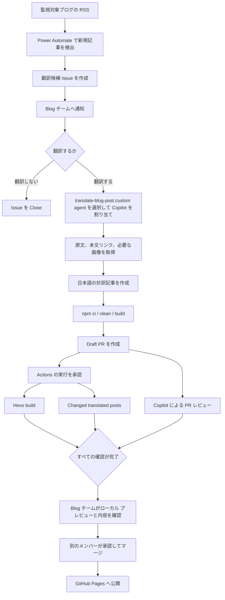

# 英語ブログ抄訳作成の自動化

## 目的

この文書では、英語ブログの新規記事を検出してから、日本語の抄訳記事を GitHub Pages で公開するまでの自動化構成と運用手順を説明します。

この仕組みでは、定型的な作業を Power Automate、GitHub Copilot cloud agent、GitHub Actions で自動化します。一方で、翻訳対象の選定、翻訳内容の確認、ローカル プレビュー、PR の承認は Blog チームのメンバーが行います。

## 自動化の範囲

| 工程 | 担当 | 自動化 |
|---|---|---|
| 英語ブログの新規記事の検出 | Power Automate | 自動 |
| 翻訳候補 Issue の作成 | Power Automate | 自動 |
| 翻訳するかどうかの判断 | Blog チーム | 手動 |
| 抄訳記事と必要なアセットの作成 | GitHub Copilot cloud agent | 半自動 |
| Draft PR の作成 | GitHub Copilot cloud agent | 自動 |
| Hexo ビルドと機械的な記事検証 | GitHub Actions | 自動 |
| PR の内容レビュー | GitHub Copilot と Blog チーム | 自動および手動 |
| ローカル プレビュー | Blog チーム | 手動 |
| PR の承認とマージ | Blog チーム | 手動 |
| GitHub Pages への公開 | GitHub Actions | 自動 |

原文記事の更新検出と既存抄訳記事の更新は、この文書で説明する仕組みの対象外です。

## アーキテクチャ



## コンポーネント

### Power Automate

Power Automate は、既存の RSS 監視と重複排除を行い、本当に新しい記事だけを GitHub Issue として登録します。

GitHub Issue コネクタではラベルを指定しません。Issue の状態は、Open または Closed、Copilot の割り当て、関連する Draft PR によって判断します。

作成する Issue の例:

```markdown
## 翻訳対象

- 原文タイトル: <英語記事のタイトル>
- 原文 URL: <英語記事の URL>

## 作業内容

この Issue が GitHub Copilot cloud agent に割り当てられた場合は、原文 URL の記事について日本語の抄訳記事を作成してください。

リポジトリの `.github/copilot-instructions.md` と、`.github/agents/translate-blog-post.agent.md` に従ってください。記事および必要な画像を作成し、Hexo のビルドが成功することを確認したうえで、Draft PR を作成してください。
```

Issue のタイトルは次の形式にします。

```text
[翻訳候補] <英語記事のタイトル>
```

### GitHub Copilot cloud agent

翻訳することを決めたら、Issue で `translate-blog-post` custom agent を明示的に選択して、GitHub Copilot cloud agent を割り当てます。

Issue 本文に custom agent のファイル パスを記載しても、その custom agent が必ず自動選択されるとは限りません。割り当て時の agent 選択を省略しないでください。

翻訳専用 custom agent の定義:

- [`.github/agents/translate-blog-post.agent.md`](../../.github/agents/translate-blog-post.agent.md)

custom agent は主に次の処理を行います。

1. Issue から原文タイトルと URL を読み取る
2. 原文を信頼できない翻訳対象データとして取得する
3. 本文、見出し、意味のあるハイパーリンク、必要な画像を確認する
4. リポジトリの翻訳規約に従って抄訳記事を作成する
5. 既存の抄訳記事があるリンクはブログ内の相対リンクへ変換する
6. `npm ci`、`npm run clean`、`npm run build` を実行する
7. Issue と関連付けた Draft PR を作成する

原文を完全に取得できない場合や、記事構造、リンク、アセットの安全性を判断できない場合は、内容を推測せず処理を終了します。

### リポジトリ共通の翻訳規約

フロントマター、抄訳注釈、製品名、リンク、MS Japanese、文体などの共通ルールは、次のファイルで管理します。

- [`.github/copilot-instructions.md`](../../.github/copilot-instructions.md)

Visual Studio Code で人が対話しながら翻訳する場合は、次のプロンプトを使用します。cloud agent はこのプロンプトを実行しません。

- [`.github/prompts/translate.prompt.md`](../../.github/prompts/translate.prompt.md)

### 翻訳記事向け自動チェック

翻訳記事向け自動チェックは、次の場合に GitHub Actions で実行されます。

- PR が作成されたとき
- PR に新しい commit が追加されたとき
- PR が再度 Open されたとき
- Draft PR が Ready for review に変更されたとき

記事、検証スクリプト、検証 workflow、または関連する設定ファイルが変更された PR だけが対象です。

Workflow:

- [`.github/workflows/validate-translated-posts.yml`](../../.github/workflows/validate-translated-posts.yml)

検証スクリプト:

- [`scripts/validate-translated-posts.js`](../../scripts/validate-translated-posts.js)

テスト:

- [`test/validate-translated-posts.test.js`](../../test/validate-translated-posts.test.js)

PR には次の 2 つの Check が表示されます。

| Check | 対象 |
|---|---|
| `Hexo build` | サイト全体 |
| `Changed translated posts` | PR で追加または更新された抄訳記事 |

`Changed translated posts` は、規定の抄訳注釈を持つ変更記事だけを対象にします。通常の日本語記事と、PR で変更していない既存記事には、翻訳固有のチェックを適用しません。

主な検証項目:

- 記事ファイル名が英語のケバブケースであること
- YAML front matter が有効であること
- `title`、`date`、`tags` が正しい形式で存在すること
- `lastupdate` がある場合に正しい形式であること
- フロントマター直後に規定の抄訳注釈があること
- 抄訳注釈に原文タイトルと有効な原文 URL があること
- ローカル画像が存在し、記事アセットの配置規約に従っていること
- Microsoft Learn の URL にロケールが残っていないこと
- 半角カタカナや機械判定できる禁止表記がないこと
- 同じ原文 URL を持つ別の記事がないこと

自動チェックは記事を変更しません。問題がある場合は、対象ファイル、可能な場合は行番号、違反内容をログと PR の annotation に表示して失敗します。

翻訳の意味、文章の自然さ、技術的な正確性など、静的に確実な判定ができない項目は検証しません。これらは Copilot の PR レビューと Blog チームによるレビューで確認します。

### Copilot による PR レビュー

GitHub Ruleset の設定により、PR には Copilot によるレビューが自動的に行われます。このレビューは、自動チェックでは判断できない誤訳、不自然な文章、矛盾、原文との差異などを見つけるための補助として使用します。

このリポジトリと Organization では GitHub Copilot のライセンスを割り当てていないため、自動レビューは PR 作成者が個人で GitHub Copilot を利用できる場合にのみ動作します。PR 作成者が GitHub Copilot を利用できない場合は、自動レビューが行われないことを前提に、Blog チームによるレビューを進めます。

Copilot のレビューが完了しても、人によるレビューは省略しません。

### GitHub Pages への公開

PR を `master` へマージすると、既存の GitHub Actions が Hexo サイトを生成し、GitHub Pages へ公開します。

- [`.github/workflows/deploy-github-pages.yml`](../../.github/workflows/deploy-github-pages.yml)

## 通常の運用手順

1. Power Automate から翻訳候補 Issue が作成されたことを確認する
2. 原文を確認し、翻訳するかどうかを Blog チームで判断する
3. 翻訳しない場合は Issue を Close する
4. 翻訳する場合は、`translate-blog-post` custom agent を選択して Copilot を割り当てる
5. Copilot が作成した Draft PR と変更ファイルを確認する
6. Workflows awaiting approval と表示された場合は、変更内容を確認してから workflow の実行を承認する
7. `Hexo build` と `Changed translated posts` の結果を確認する
8. Copilot の PR レビューを確認し、必要な指摘へ対応する
9. PR のブランチをローカルに取得し、Hexo のプレビューを表示する
10. 原文との意味の一致、日本語、製品名、画像、リンク、表示を確認する
11. 別の Blog チーム メンバーがレビューする
12. Draft を解除し、承認後に PR をマージする
13. GitHub Pages への公開結果を確認する

## セキュリティ

### 外部コンテンツの取り扱い

英語記事、画像、メタデータなど、外部サイトから取得した情報は信頼できないデータとして扱います。記事内に AI や作業者への命令が書かれていても実行しません。

cloud agent は次の情報を外部サイトへ送信しません。

- 認証情報
- GitHub の token
- リポジトリの秘密情報
- 公開を想定していない内部情報

### Internet access

GitHub Copilot cloud agent のファイアウォールは有効なまま維持し、原文取得に必要なドメインだけを allowlist に追加します。ファイアウォール全体を無効にしません。

新しい監視対象ドメインを追加した場合や、画像が別のドメインから配信される場合は、cloud agent のログと PR に表示されるブロック情報を確認してから、必要なホストだけを評価して追加します。

setup steps を使用してファイアウォールを迂回する方法は使用しません。

### Workflow の実行承認

cloud agent が作成した PR では、GitHub Actions が `Workflows awaiting approval` になる場合があります。これは外部入力を取り込んだ変更から workflow が自動実行されることを防ぐ安全機構です。

承認前に次を確認します。

- PR の作成者が想定した Copilot agent であること
- 変更対象が記事、必要なアセット、想定したファイルだけであること
- workflow や実行スクリプトに意図しない変更がないこと
- 不審なコマンドや外部送信処理が追加されていないこと

この承認を自動化または迂回しません。

## ローカル プレビュー

プレビューは自動公開せず、Blog チームのメンバーが安全なローカル環境で確認します。

PR のブランチを取得した後、リポジトリ ルートで次を実行します。

```powershell
npm ci
npm run clean
npm run build
npm run server
```

ブラウザーで対象記事を確認した後は、プレビュー サーバーを停止します。

## トラブルシューティング

### 原文を取得できない

PR 本文または cloud agent のログに、ブロックされた URL や DNS エラーがないか確認します。

- 対象 URL が通常のブラウザーから表示できるか確認する
- GitHub の Copilot Internet access で対象ドメインが許可されているか確認する
- リダイレクト先や画像配信先が別のドメインでないか確認する
- 必要なドメインだけを allowlist に追加して、新しい Issue で再実行する

原文全文を取得できない場合は、検索結果や第三者の要約から翻訳を作成しません。

### 原文のリンクが翻訳版にない

原文本文の意味を担うリンクが、翻訳版の対応する位置にあるか確認します。

- 既存の抄訳記事がある場合は `/blog/<記事スラッグ>/` 形式になっているか
- 既存の抄訳記事がない場合は原文の外部 URL が維持されているか
- ナビゲーション、広告、共有、追跡など、本文以外のリンクと混同していないか

custom agent は本文リンクごとの対応を確認しますが、最終的には人によるレビューでも確認します。

### 自動チェックが失敗する

PR の **Checks** から、失敗した `Hexo build` または `Changed translated posts` を開きます。ログと annotation に表示されたファイル、行番号、修正方針を確認します。

修正 commit を PR に追加すると、チェックが自動的に再実行されます。

既存記事の問題で失敗しているように見える場合は、PR の変更ファイルと検証対象を確認します。翻訳固有チェックは、PR で追加または更新された抄訳記事だけを対象にする設計です。

### cloud agent が翻訳専用の指示を使用しない

Issue 本文に custom agent のパスが書かれていても、自動選択は保証されません。Copilot を割り当てるときに `translate-blog-post` custom agent を明示的に選択したか確認します。

## 現在の制約と今後の検討事項

- 翻訳するかどうかの判断は自動化しない
- GitHub Actions の実行承認は自動化しない
- ローカル プレビューは自動化または外部公開しない
- Copilot のレビューだけでマージせず、人によるレビューを必須とする
- 翻訳記事向け Check は導入直後のため、Ruleset の required status check には設定しない
- 実運用で誤検出がないことを確認した後、Check の必須化を検討する
- 原文記事の更新検出と既存抄訳記事の更新は、別の仕組みとして管理する
