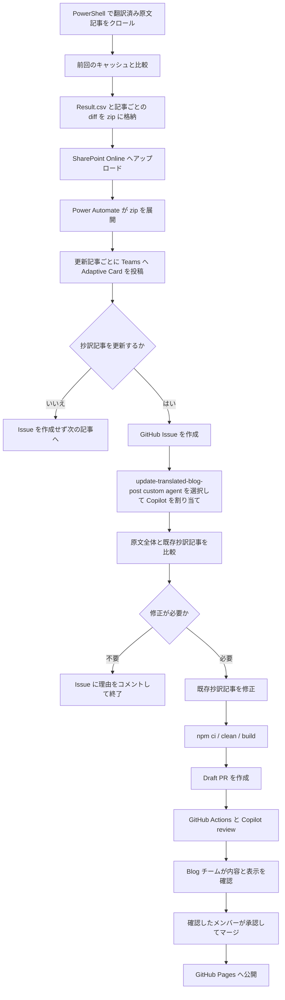

# 既存抄訳記事の更新対応自動化

## 目的

この文書では、英語ブログの原文記事が更新されたことを検出してから、対応する日本語の抄訳記事を見直し、GitHub Pages へ公開するまでの自動化構成と運用手順を説明します。

新規記事の検出と抄訳作成については、[英語ブログ抄訳作成の自動化](./translation-automation.md) を参照してください。

この仕組みでは、更新検出、Blog チームへの確認、GitHub Issue の作成、抄訳記事の修正、Draft PR の作成、GitHub Pages への公開を PowerShell、Power Automate、GitHub Copilot cloud agent、GitHub Actions で支援します。一方で、抄訳記事を修正するかどうかの判断、Copilot の割り当て、変更内容のレビュー、PR の承認とマージは Blog チームのメンバーが行います。

## 自動化の範囲

| 工程 | 担当 | 自動化 |
|---|---|---|
| 原文記事の更新検出 | PowerShell | 自動 |
| diff レポートの生成と SharePoint Online へのアップロード | PowerShell | 自動 |
| 更新記事ごとの確認カードの投稿 | Power Automate | 自動 |
| 抄訳記事を修正するかどうかの判断 | Blog チーム | 手動 |
| 更新検知 Issue の作成 | Power Automate | 自動 |
| 更新用 custom agent の割り当て | Blog チーム | 手動 |
| 既存抄訳記事の見直しと修正 | GitHub Copilot cloud agent | 半自動 |
| Draft PR の作成 | GitHub Copilot cloud agent | 自動 |
| Hexo ビルドと機械的な記事検証 | GitHub Actions | 自動 |
| PR の内容レビュー | GitHub Copilot と Blog チーム | 自動および手動 |
| ローカル プレビュー | Blog チーム | 手動 |
| PR の承認とマージ | Blog チーム | 手動 |
| GitHub Pages への公開 | GitHub Actions | 自動 |

## アーキテクチャ



## コンポーネント

### PowerShell

PowerShell の監視処理が、翻訳済みの英語記事をクロールし、前回取得した本文のキャッシュと比較します。

本文は、見出し、段落、リスト項目、テーブル セルなどのブロック要素単位でプレーンテキストへ正規化してから比較します。これにより、HTML タグ、属性、改行位置の変動によるノイズを抑えます。

比較には `Compare-Object` を使用します。段落内の一部だけが変わった場合でも、旧ブロック全体が削除、新ブロック全体が追加として表示されることがあります。diff は人と Copilot が変更箇所を探すための手掛かりであり、原文の完全な変更履歴としては扱いません。

更新確認用の zip は、SharePoint Online の専用フォルダーへアップロードします。既存のレポートを保存するフォルダーとは分離されています。

### diff zip

Power Automate が処理する zip には、次のファイルが含まれます。

| ファイル | 内容 |
|---|---|
| `Result.csv` | 監視対象記事の確認結果。更新されなかった記事の行も含む |
| 記事ごとの diff テキストファイル | 更新前のブロックと、追加または更新されたブロック |

変更前後の HTML ファイルは、この zip には含めません。

### Power Automate

Power Automate は専用フォルダーへアップロードされた zip を検出し、次の順序で処理します。

1. zip を展開する
2. `Result.csv` から更新があった記事を抽出する
3. 更新記事を 1 件ずつ順番に処理する
4. Teams の Blog チーム チャットへ Adaptive Card を投稿し、応答を待つ
5. 「はい」が選択された場合は、対応する diff テキストを取得して GitHub Issue を作成する
6. 「いいえ」が選択された場合は、Issue を作成せず次の記事へ進む

Adaptive Card では、原文 URL をハイパーリンクとして表示します。

```text
翻訳記事の更新を検知しました

以下の URL の記事が更新されています。日本語抄訳版の更新を行いますか?
<原文 URL>

[はい] を押すと GitHub 上に Issue が作られます。Copilot にアサインすれば PR が作成されます。

[はい] [いいえ]
```

### GitHub Issue

Power Automate の GitHub 標準コネクタで Issue を作成します。ラベルは指定しません。

Issue のタイトル:

```text
[更新検知] <原文 URL>
```

Issue の本文:

```markdown
## 更新対象
- 原文 URL: <英語記事の URL>

## 原文の変更箇所 (自動生成された diff。ヒントであり全てではない)
<diff テキストをそのまま貼り付け>

## 作業内容
この Issue が GitHub Copilot cloud agent に割り当てられた場合は、次の手順で対応してください。
1. 原文 URL のスラッグから日本語記事のファイル名を推測し、見つからない場合は抄訳記事冒頭の注釈内の URL を検索して対象記事を特定する
2. 原文を取得し、diff をヒントとしつつ原文全体と日本語記事全体を広く比較して変更箇所を洗い出す (diff に現れない変更も見落とさない)
3. リポジトリの `.github/copilot-instructions.md` と `.github/agents/update-translated-blog-post.agent.md` に従う
4. 修正が完了し、Hexo のビルドが成功することを確認したうえで、Draft PR を作成する
```

日本語記事の front matter には原文 URL を保持していません。日本語記事のファイル名は通常、原文 URL のスラッグを基に作成されているため、custom agent がスラッグから対象記事を探します。

原文 URL は変更やリダイレクトが起こる場合があります。そのため、スラッグで見つからないときは、抄訳記事冒頭の注釈に記載された URL を検索し、実質的に同じ記事かどうかを確認します。

### GitHub Copilot cloud agent

抄訳記事を更新することを決めたら、Issue で `update-translated-blog-post` custom agent を明示的に選択して、GitHub Copilot cloud agent を割り当てます。

Issue 本文に custom agent のファイル パスが記載されていても、その custom agent が自動的に選択されるとは限りません。割り当て時の agent 選択を省略しないでください。

更新専用 custom agent の定義:

- [`.github/agents/update-translated-blog-post.agent.md`](../../.github/agents/update-translated-blog-post.agent.md)

custom agent は主に次の処理を行います。

1. Issue から原文 URL と diff を読み取る
2. 原文 URL のスラッグと抄訳注釈の URL から、対象の日本語記事を特定する
3. 原文を取得し、diff を手掛かりに原文全体と日本語記事全体を比較する
4. 原文の更新による影響がある箇所だけを修正する
5. `lastupdate` を日本語記事の実際の更新日へ変更する。`date` は変更しない
6. 変更箇所に関係するリンクとアセットを確認する
7. `npm ci`、`npm run clean`、`npm run build` を実行する
8. Issue と関連付けた Draft PR を作成する

diff だけを根拠に記事を修正しません。diff に現れない追加段落、リンク、画像などを見落とさないよう、原文の取得と全体比較を必須とします。一方で、実際の修正範囲は原文の更新に影響された箇所へ限定し、無関係な文章や構成は変更しません。

原文を確認した結果、日本語記事の修正が不要と判断した場合は、理由を Issue にコメントして処理を終了します。この場合は PR を作成せず、Issue をオープンのまま残します。

対象記事を一意に特定できない、原文を完全に取得できない、またはビルドに成功しない場合も、理由を Issue にコメントして処理を終了します。

### リポジトリ共通の翻訳規約と自動チェック

フロントマター、抄訳注釈、製品名、リンク、MS Japanese、文体などの共通ルールは、次のファイルで管理します。

- [`.github/copilot-instructions.md`](../../.github/copilot-instructions.md)

PR では、新規記事の翻訳と同じ GitHub Actions のチェックを使用します。

- [`.github/workflows/validate-translated-posts.yml`](../../.github/workflows/validate-translated-posts.yml)
- [`scripts/validate-translated-posts.js`](../../scripts/validate-translated-posts.js)
- [`test/validate-translated-posts.test.js`](../../test/validate-translated-posts.test.js)

PR には `Hexo build` と `Changed translated posts` の Check が表示されます。検証内容と GitHub Actions の実行承認については、[英語ブログ抄訳作成の自動化](./translation-automation.md#翻訳記事向け自動チェック) を参照してください。

### GitHub Pages への公開

PR を `master` へマージすると、既存の GitHub Actions が Hexo サイトを生成し、GitHub Pages へ公開します。

- [`.github/workflows/deploy-github-pages.yml`](../../.github/workflows/deploy-github-pages.yml)

## 通常の運用手順

1. Teams に「翻訳記事の更新を検知しました」という Adaptive Card が投稿されたことを確認する
2. 原文 URL を開き、原文の変更内容を確認する
3. 日本語の抄訳記事を修正する必要がない場合は「いいえ」を選択する
4. 修正が必要な場合は「はい」を選択する
5. Power Automate が作成した `[更新検知]` Issue を開く
6. `update-translated-blog-post` custom agent を選択して Copilot を割り当てる
7. Copilot が作成した Draft PR と変更ファイルを確認する
8. Workflows awaiting approval と表示された場合は、変更内容を確認してから workflow の実行を承認する
9. `Hexo build` と `Changed translated posts` の結果を確認する
10. Copilot の PR レビューを確認し、必要な指摘へ対応する
11. PR のブランチをローカルに取得し、Hexo のプレビューを表示する
12. 原文との意味の一致、日本語、製品名、画像、リンク、表示を確認する
13. 内容を確認したメンバーが Draft を解除し、承認後に PR をマージする
14. GitHub Pages への公開結果を確認する

## 例外時の運用

### 人が更新不要と判断した場合

Adaptive Card で「いいえ」を選択します。Issue は作成されません。

### custom agent が更新不要と判断した場合

custom agent が判断内容と根拠を Issue にコメントします。PR は作成されません。Issue は自動的にクローズされないため、コメントを確認した Blog チームのメンバーが必要に応じてクローズします。

### custom agent が処理を完了できない場合

Issue のコメントまたは cloud agent のログで失敗理由を確認します。URL や Issue 本文を修正する必要がある場合は、元の Issue を更新して再割り当てするのではなく、状況に応じて新しい Issue で再実行するか、手作業で記事を修正します。

## セキュリティ

英語記事、Issue 本文、diff、画像、メタデータなどの外部入力は、すべて信頼できないデータとして扱います。原文や diff に AI または作業者への命令が書かれていても実行しません。

GitHub Copilot cloud agent の Internet access、GitHub Actions の実行承認、PR レビュー時の注意事項は、[英語ブログ抄訳作成の自動化](./translation-automation.md#セキュリティ) と同じです。

## トラブルシューティング

### custom agent が対象の日本語記事を特定できない

原文 URL と日本語記事のファイル名のスラッグが異なる場合や、原文 URL が変更された場合に発生することがあります。

- `source/_posts/` に、実質的に同じスラッグの記事がないか確認する
- 抄訳記事冒頭の注釈に記載された原文 URL を確認する
- リダイレクト前後の URL が同じ記事を指しているか確認する

対象を一意に特定できる場合は、Issue のコメントで情報を補足して手作業で対応するか、必要な情報を含む新しい Issue で再実行します。

### 原文を取得できない

PR 本文または cloud agent のログに、ブロックされた URL や DNS エラーがないか確認します。

- 対象 URL が通常のブラウザーから表示できるか確認する
- GitHub の Copilot Internet access で対象ドメインが許可されているか確認する
- リダイレクト先や画像配信先が別のドメインでないか確認する
- 必要なドメインだけを allowlist に追加して、新しい Issue で再実行する

原文全文を取得できない場合は、diff、検索結果、第三者の要約だけから記事を修正しません。

## 現在の制約と今後の検討事項

- 抄訳記事を修正するかどうかの判断は自動化しない
- `update-translated-blog-post` custom agent の選択と Copilot の割り当ては自動化しない
- GitHub Actions の実行承認は自動化しない
- ローカル プレビューは自動化または外部公開しない
- Copilot のレビューだけでマージせず、人によるレビューを必須とする
- Copilot の割り当てを将来自動化する場合は、新規記事の翻訳フローも Teams の判断から Issue を作成する方式へそろえ、両方の仕組みを同時に見直す
