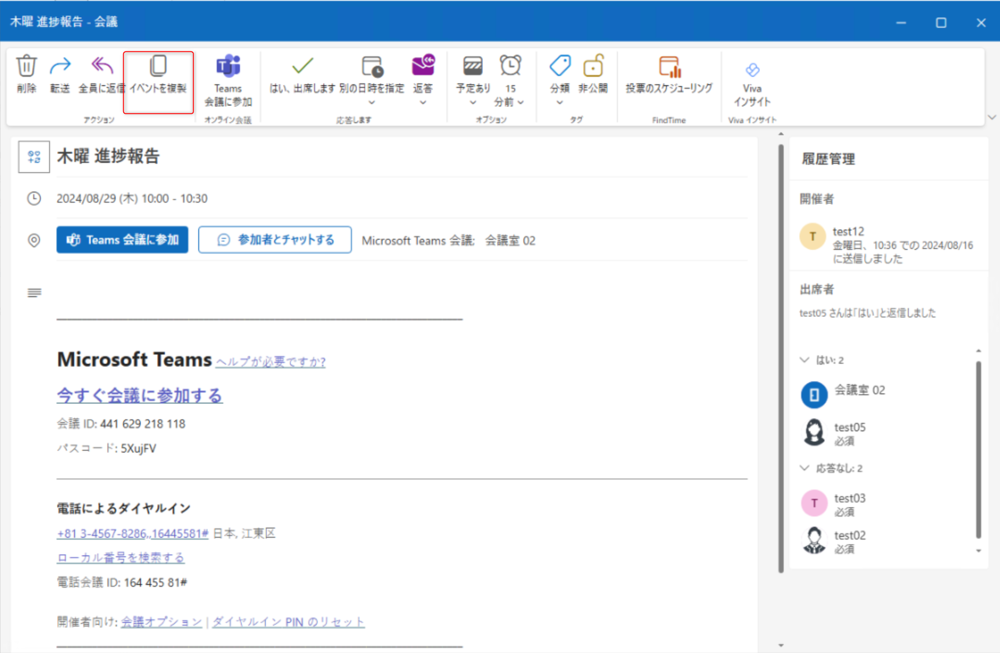

※この記事は、MC854648 - Admin policy to migrate users from classic Outlook to new Outlook for Windows に関する解説です。  

[新しい Outlook for Windows 一般提供に向けたガイド](https://jpmessaging.github.io/blog/new-outlook-for-windows-a-guide-to-product-availability/) にてご案内の通り、従来の Outlook for Windows (以下、従来の Outlook) は将来的に新しい Outlook for Windows (以下、新しい Outlook) へ切り替わる予定です。  
これに伴い、「早い段階からエンド ユーザーが新しい Outlook を利用するように促したい (新しい Outlook に慣れてもらいたい)」 「原則として新しい Outlook を利用させたい」といったニーズもあるかと存じます。  
このようなニーズに応えるべく、MC854648 ではその制御方法をご案内しております。  

<u>なお、MC854648 の制御内容 (後述の内容) はあくまでもオプションであり、管理者が明示的に制御を行わない限り、影響はありません。本オプションが不要な場合はご放念ください。  
また前提として、新しい Outlook はオンプレミス環境やソブリン クラウドにおいてサポートされておりません。</u>

## 1. 新しい Outlook へ自動的に切り替える
以下の GPO を "有効" に設定するか、[Microsoft 365 Apps admin center](https://config.office.com/) からクラウド ポリシーの **[管理者が制御する新しい Outlook への移行]** を "有効" に設定します。これにより従来の Outlook を起動するたびに新しい Outlook への切り替えが促され、最終的には一度自動的に切り替わります。  
```
[ユーザーの構成]-[ポリシー]-[管理用テンプレート]-[Microsoft Outlook 2016]-[Outlook のオプション]-[その他]-[管理者が制御する新しい Outlook への移行]
```
ポリシー展開後にユーザーが従来の Outlook を起動すると、まずは以下のプロンプトが表示されます。

切り替えを行わなかった場合、次回起動時に以下のプロンプトが表示されます。

さらに切り替えを行わなかった場合、3 回目の起動時に以下のプロンプトが表示されます。

3 回目のプロンプトが表示された後も切り替えを行わなかった場合、4 回目に従来の Outlook を起動したタイミングで自動的に新しい Outlook へ切り替わります。  

新しい Outlook にアカウントを追加してセットアップを完了させた後、ユーザーはいつでも右上のトグル ボタンから従来の Outlook に戻すことが可能です。  

一度従来の Outlook に戻すと、それ以降は従来の Outlook を起動してもプロンプトが表示されず、新しい Outlook へ自動的に切り替わることもありません。

なお、以下のレジストリを端末に作成した場合も同様の制御が行われます。
```
値の場所: HKEY_CURRENT_USER\Software\Microsoft\Office\16.0\Outlook\Options\General
値の種類: REG_DWORD
値の名前: DoNewOutlookAutoMigration
値のデータ: 1
```

### 留意事項
上記の制御を行うには、以下を満たす必要があります:  
・従来の Outlook の [新しい Outlook を試す] トグル ボタンが利用可能である  
・従来の Outlook がバージョン 2407 (ビルド 17830.20138) 以上である

## 2. 新しい Outlook へ自動切替を行う間隔を設定する
「1. 新しい Outlook へ自動的に切り替える」制御が行われている場合、以下の GPO やクラウド ポリシーの **[ユーザーがトグルをオフにして Outlook Desktop に戻った後に "新しい Outlook の自動移行" を一時停止する日数]** も "有効" にすることで、ユーザーが従来の Outlook へ戻してから再び新しい Outlook へ自動的に切り替える間隔を制御できます。
```
[ユーザーの構成]-[ポリシー]-[管理用テンプレート]-[Microsoft Outlook 2016]-[Outlook のオプション]-[その他]-[Outlook の新しい移行試行の間隔]
```
上記ポリシー内のオプションである **[新しい Outlook 自動へ自動的に再度切り替える間隔]** に指定する値 N (0 から 9900 までの任意の 10 進数) によって動作が異なるため、それぞれのシナリオについて考えてみます。  

### N=0 の場合
上記ポリシーを "有効" に設定していない時と同様の動作となります。(新しい Outlook へ再度切り替える動作は発生しません。)

### N=1 の場合
「1. 新しい Outlook へ自動的に切り替える」制御で自動的に新しい Outlook へ切り替わった後、ユーザーは右上のトグル ボタンで従来の Outlook に戻すことが可能です。

新しい Outlook に関するフィードバックを送信するかスキップすると、従来の Outlook へ切り替わるとともに以下のプロンプトが表示されます。ユーザーは [次回に切り替える] か右上の X を選択してプロンプトを消し、そのまま従来の Outlook を利用することができます。

そして、次回ユーザーが従来の Outlook を起動すると、再度新しい Outlook へ切り替わる動作となります。  
つまり、ユーザーが従来の Outlook を起動しようとしても新しい Outlook が起動し、従来の Outlook を利用したい場合は毎回トグル ボタンで従来の Outlook に戻す必要があります。

### 2≦N≦9900 の場合
N を 2 としており、ユーザーが 2024/10/7 14:43 にトグル ボタンで従来の Outlook に戻したとします。

この場合、2024/10/9 14:43 までの間はユーザーが従来の Outlook を起動してもプロンプトは表示されません。  
 2024/10/9 14:44 以降は、ユーザーが従来の Outlook を起動するたび、新しい Outlook の利用を促すプロンプトが 3 回に渡って表示されます。※以下は 1 回目のプロンプトです。  

3 回目のプロンプトが表示された後も切り替えを行わなかった場合、その後に従来の Outlook を起動したタイミングで新しい Outlook へ切り替わります。  
つまり、ユーザーが従来の Outlook へ戻すと N 日後から 3 回に渡って新しい Outlook の利用を促し、再度新しい Outlook へ切り替える動作となります。このプロセスは、ユーザーが従来の Outlook へ戻すたびに繰り返されます。

 なお、以下のレジストリを端末に作成した場合も同様の制御が行われます。
```
値の場所: HKEY_CURRENT_USER\Software\Microsoft\Office\16.0\Outlook\Options\General
値の種類: REG_DWORD
値の名前: NewOutlookAutoMigrationRetryIntervals
値のデータ: <0 から 9900 までの任意の 10 進数>
```