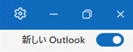

こんにちは。日本マイクロソフト Exchange & Outlook サポート チームの八木です。  
本記事では **Microsoft 365 Enterprise ライセンスをご利用のお客様向け**に、2024 年 12 月 6 日に通知された**メッセージセンター投稿 MC949965** の内容をわかりやすく解説します。  
特に、<b>新しい Outlook for Windows への移行に関する「オプトアウト ステージ」</b>での動作や、自動切り替えを防ぐ方法について詳しく説明します。  

<svg viewBox="0 0 16 16" version="1.1" width="16" height="16" aria-hidden="true" style="margin-right:8px">
<path fill="#1a7f37" d="M8 1.5c-2.363 0-4 1.69-4 3.75 0 .984.424 1.625.984 2.304l.214.253c.223.264.47.556.673.848.284.411.537.896.621 1.49a.75.75 0 0 1-1.484.211c-.04-.282-.163-.547-.37-.847a8.456 8.456 0 0 0-.542-.68c-.084-.1-.173-.205-.268-.32C3.201 7.75 2.5 6.766 2.5 5.25 2.5 2.31 4.863 0 8 0s5.5 2.31 5.5 5.25c0 1.516-.701 2.5-1.328 3.259-.095.115-.184.22-.268.319-.207.245-.383.453-.541.681-.208.3-.33.565-.37.847a.751.751 0 0 1-1.485-.212c.084-.593.337-1.078.621-1.489.203-.292.45-.584.673-.848.075-.088.147-.173.213-.253.561-.679.985-1.32.985-2.304 0-2.06-1.637-3.75-4-3.75ZM5.75 12h4.5a.75.75 0 0 1 0 1.5h-4.5a.75.75 0 0 1 0-1.5ZM6 15.25a.75.75 0 0 1 .75-.75h2.5a.75.75 0 0 1 0 1.5h-2.5a.75.75 0 0 1-.75-.75Z"></path>
</svg>
補足

本記事で用いる「従来の Outlook for Windows (以下、従来の Outlook)」は便宜的に、サブスクリプション版である Microsoft 365 Apps を示します。 
狭義で用いるため、買い切り型の永続的なライセンス版 (例 : Office 2024) は含んでいません。

従来の Outlook から新しい Outlook for Windows (以下、新しい Outlook) への移行に関するタイムラインとロードマップは以下の公開情報で概説されています。  

[New Outlook: Guide to product availability | Microsoft Learn](https://learn.microsoft.com/microsoft-365-apps/outlook/get-started/guide-product-availability)

上記公開情報に記載の Stage 2: Opt-out (オプトアウト ステージ) の開始時期はご利用の Microsoft 365 ライセンスによって異なります。  

|**対象となるお客様**|**オプトアウト ステージ開始時期**|**メッセージ センター投稿**|
|-|-|-|
|Microsoft 365 Business Standard ライセンス または   Microsoft 365 Business Premium ライセンスをご利用のお客様|2025 年 1 月|MC926895|
|Microsoft 365 Education ライセンスをご利用のお客様|2026 年 1 月|MC1043472|
|Microsoft 365 Enterprise ライセンスをご利用のお客様|2026 年 4 月|MC949965|

※各通知は対象となるお客様に通知されています。通知の内容は Microsoft 365 管理センターのメッセージ センターにてご確認ください。

以下、**Microsoft 365 Enterprise ライセンスをご利用のお客様向け**に通知された **MC949965** について QA 形式で説明します。

<svg viewBox="0 0 16 16" width="16" height="16" aria-hidden="true" style="margin-right:8px">
<path fill="#ff7518" d="M6.457 1.047c.659-1.234 2.427-1.234 3.086 0l6.082 11.378A1.75 1.75 0 0 1 14.082 15H1.918a1.75 1.75 0 0 1-1.543-2.575Zm1.763.707a.25.25 0 0 0-.44 0L1.698 13.132a.25.25 0 0 0 .22.368h12.164a.25.25 0 0 0 .22-.368Zm.53 3.996v2.5a.75.75 0 0 1-1.5 0v-2.5a.75.75 0 0 1 1.5 0ZM9 11a1 1 0 1 1-2 0 1 1 0 0 1 2 0Z"></path>
</svg>
注意

本記事の内容は、Microsoft 365 Enterprise ライセンスを対象としたオプトアウト ステージの期間の動作に特化して記載しています。 
カットオーバー ステージ以降は動作が変更となる可能性があることにご注意ください。

**Q1. 管理者が何もしない場合、2026 年 4 月以降にこの自動切り替えは発生しますか。**

A1. はい。発生します。

**Q2. オプトアウト ステージでは、従来の Outlook から新しい Outlook への自動切り替えが実施されるのは一度だけですか。**

A2. 厳密にはいいえとなります。オプトアウトのロールアウトではユーザーは一度だけ従来の Outlook から新しい Outlook に自動的に切り替わります。  
但し、この変更の目的はユーザーに新しい Outlook を試す機会を提供することです。  
そのため、MC949965 に記載の通り、一度新しい Outlook に自動的に切り替わってからユーザーが従来の Outlook に戻した後、将来的に再度自動切り替えが発生する可能性があります。  
自動切り替えを抑止したい場合は、後述の A6. の設定にて可能です。

**Q3. 自動切り替えが発生する時、ユーザーに何か通知は表示されますか。**

A3. はい。これは段階的に通知が表示されることが想定されます。  
以下公開情報の「自動スイッチ エクスペリエンス」の項に具体的な通知の例があります。  
[新しい Outlook for Windows に切り替える - Microsoft サポート](https://support.microsoft.com/office/f5fb9e26-af7c-4976-9274-61c6428344e7)  
但し、MC949965 に記載の通り、この公開情報は 2026 年 4 月に近づき次第更新される可能性があるため適宜ご参照ください。

**Q4. 新しい Outlook に自動的に切り替えられた後、従来の Outlook に戻せますか。**  

A4. はい。新しい Outlook で以下いずれかの操作を実施することで戻せます。  
- 右上のトグルをオフ (左側に●印) にする  

- リボンより、[ヘルプ]-[従来の Outlook に移動] をクリックする  

**Q5. ユーザー側の操作で自動切り替えを抑止することはできますか。**

A5. はい。MC949965 に記載の通り、オプトアウト ステージでの自動切り替えエクスペリエンスに参加しないように設定できます。  
具体的には、従来の Outlook のオプションの [ファイル]-[オプション]-[全般]-[自動的に新しい Outlook に切り替える] をオフにします。  
なお、このオプションが表示されない場合は、現時点では新しい Outlook への自動切り替えの対象になっていないことを意味します。  
上記は以下公開情報にも記載があります。  
[新しい Outlook for Windows に切り替える - Microsoft サポート](https://support.microsoft.com/office/f5fb9e26-af7c-4976-9274-61c6428344e7)

**Q6. 自動切り替えが発生しないシナリオはありますか。**

A6. はい。MC949965 に記載の通り、以下のいずれかのシナリオに該当する場合は発生しません。  
A) 従来の Outlook から新しい Outlook への自動移行を抑止するレジストリを設定している  
B) [新しい Outlook を試す] トグルを非表示にするレジストリを設定している  
C) 永続的なライセンス版の Office 製品をご利用である  
D) 自身のメールボックスがオンプレミス Exchange サーバー上にある  

各々詳細は以下の通りです。  
以下 A) ～ D) はクリックすることにより、展開・省略表示が可能なため、参照したい項目をクリックして展開してご参照ください。  

<b>A) 従来の Outlook から新しい Outlook への自動移行を抑止するレジストリを設定している</b>

従来の Outlook から新しい Outlook への自動移行を抑止するレジストリを設定している場合は自動移行の対象外となります。 
このレジストリについての公開情報は以下となります。 
<a href="https://learn.microsoft.com/microsoft-365-apps/outlook/get-started/control-install?branch=main#policy-manage-user-setting-for-new-outlook-automatic-migration" target="_blank">Control installation and use of new Outlook | Microsoft Learn</a> 
※「Policy: Manage user setting for new Outlook automatic migration」の項をご参照ください。 
 
該当するレジストリは、グループ ポリシー / クラウド ポリシー等にて設定可能です。いずれかを選択してください。

<h3>1) グループ ポリシーでの設定方法</h3>

1. 以下の内容に沿って、最新の Microsoft Office の管理用テンプレートをダウンロードして配置します。
<a href="https://learn.microsoft.com/answers/questions/4370544/office-(gpo)-office-365-proplus" target="_blank">Office の管理用テンプレートを使用してグループ ポリシー (GPO) で Office 365 ProPlus を制御する - Microsoft Q&A</a> 
2. [Default Domain Policy] もしくは、グループ ポリシーを適用させたい OU のグループ ポリシー オブジェクトを選択して右クリックし、[編集] を選択します。グループ ポリシー管理エディタ画面にて、以下の操作を行います。
3. [ユーザーの構成]-[ポリシー]-[管理用テンプレート]-[Microsoft Outlook 2016]-[Outlook のオプション]-[その他]-[Manage user setting for new Outlook automatic migration] をクリックします。
4. [無効] を選択し、[OK] をクリックします。 
※グループ ポリシーが反映されるまでタイムラグがあります。即時の確認を行いたい場合、クライアント PC のコマンド プロンプトより gpupdate/force を実行ください。 
  
上記設定を行うと端末には以下のレジストリが設定されます。 
キーのパス: HKEY_CURRENT_USER\Software\Policies\Microsoft\Office\16.0\Outlook\Preferences 
値の名前: NewOutlookMigrationUserSetting 
種類: REG_DWORD 
値: 0

<h3>2) クラウド ポリシーでの設定方法</h3>
クラウド ポリシーは Microsoft 365 Apps for enterprise に Microsoft Entra ID ベースのアカウントでサインインしていれば、グループ ポリシーのようにオンプレミス AD に参加していないデバイスに対してもポリシー設定を配布できます。 
クラウド ポリシーはグループ単位あるいはテナント単位で設定できます。 
 
<参考情報> 
クラウド ポリシーの要件などについては以下の公開情報をご参照ください。 
<a href="https://learn.microsoft.com/microsoft-365-apps/admin-center/overview-cloud-policy" target="_blank">Microsoft 365 向けクラウド ポリシー サービスの概要 - Microsoft 365 Apps | Microsoft Learn</a> 

1. <a href="https://config.office.com" target="_blank">Microsoft 365 Apps admin center</a> にアクセスし、[サインイン] をクリックしてテナントの管理者でサインインします。
2. [カスタマイズ]-[ポリシー管理]-[+ 作成] をクリックします。
3. 名前欄に任意の名前を入力して [次] をクリックします。
4. [このポリシー構成は、指定されたグループのユーザーに適用されます] を選択して [+ グループの追加] をクリックし、適用させたいユーザーを含むグループを選択して [保存]-[次] をクリックします。
5. 検索欄に "Manage user setting for new Outlook automatic migration" と入力して検索し、表示されたポリシー [Manage user setting for new Outlook automatic migration] をクリックします。
6. [無効] を選択して、[適用]-[次] をクリックします。
7. [作成] をクリックします。 
 
上記設定後、端末側で Microsoft 365 Apps for enterprise にグループで指定した Microsoft Entra ID ユーザーでサインインし、反映されると端末に以下のレジストリが設定されます。 
キーのパス: HKEY_CURRENT_USER\SOFTWARE\Policies\Microsoft\<b>Cloud</b>\Office\16.0\Outlook\Preferences 
キー名: NewOutlookMigrationUserSetting 
種類: REG_DWORD 
値: 0 

<svg viewBox="0 0 16 16" width="16" height="16" aria-hidden="true" style="margin-right:8px">
<path fill="#ff7518" d="M6.457 1.047c.659-1.234 2.427-1.234 3.086 0l6.082 11.378A1.75 1.75 0 0 1 14.082 15H1.918a1.75 1.75 0 0 1-1.543-2.575Zm1.763.707a.25.25 0 0 0-.44 0L1.698 13.132a.25.25 0 0 0 .22.368h12.164a.25.25 0 0 0 .22-.368Zm.53 3.996v2.5a.75.75 0 0 1-1.5 0v-2.5a.75.75 0 0 1 1.5 0ZM9 11a1 1 0 1 1-2 0 1 1 0 0 1 2 0Z"></path>
</svg>
注意

上記の [Manage user setting for new Outlook automatic migration] ポリシーは、管理者が従来の Outlook から新しい Outlook への移行を積極的に推進したい場合に利用する [管理者が制御する新しい Outlook への移行] ポリシーによって開始された移行には適用されません。 
[管理者が制御する新しい Outlook への移行] ポリシーの詳細については、以下の公開情報およびブログをご参照ください。 
<a href="https://learn.microsoft.com/microsoft-365-apps/outlook/manage/admin-controlled-migration-policy" target="_blank">Policy for Admin-Controlled Migration to new Outlook for Windows | Microsoft Learn</a> 
<a href="https://jpmessaging.github.io/blog/MC854648/" target="_blank">新しい Outlook for Windows への移行を促すポリシー制御</a>  

 

<b>B) [新しい Outlook を試す] トグルを非表示にするレジストリを設定している</b>

[新しい Outlook を試す] トグルを非表示にするレジストリを設定している場合は自動移行の対象外となります。 
このレジストリについての公開情報は以下となります。 
<a href="https://learn.microsoft.com/exchange/clients-and-mobile-in-exchange-online/outlook-on-the-web/enable-disable-employee-access-new-outlook#use-the-registry-to-enable-or-disable-the-try-the-new-outlook-toggle-in-classic-outlook" target="_blank">Outlook for Windows へのアクセスを有効または無効にする | Microsoft Learn</a> 
※「レジストリを使用して、従来の Outlook で [新しい Outlook を試す] トグルを有効または無効にする」の項をご参照ください。 
 
該当するレジストリは、グループ ポリシー / クラウド ポリシー等にて設定可能です。いずれかを選択してください。

<h3>1) グループ ポリシーでの設定方法</h3>

1. 上記 A) - 1) に沿って、最新の Microsoft Office の管理用テンプレートをダウンロードして配置し、グループ ポリシー管理エディタ画面を表示します。 
2. [ユーザーの構成]-[ポリシー]-[管理用テンプレート]-[Microsoft Outlook 2016]-[Outlook のオプション]-[その他]-[Outlook に [新しい Outlook を試してみる] 切り替えスイッチを表示しない] をクリックします。
3. [有効] を選択し、[OK] をクリックします。 
※グループ ポリシーが反映されるまでタイムラグがあります。即時の確認を行いたい場合、クライアント PC のコマンド プロンプトより gpupdate/force を実行ください。 
  
上記設定を行うと端末には以下のレジストリが設定されます。 
キーのパス: HKEY_CURRENT_USER\Software\Policies\Microsoft\Office\16.0\Outlook\Options\General 
値の名前: HideNewOutlookToggle 
種類: REG_DWORD 
値: 1 

<h3>2) クラウド ポリシーでの設定方法</h3>

1. 上記 A) - 2) に沿って、クラウド ポリシーを新規作成するか、既にグループあるいはテナントに割り当て済みのクラウド ポリシーを開きます。
2. 検索欄に "Outlook に [新しい Outlook を試してみる] 切り替えスイッチを表示しない" と入力して検索し、表示されたポリシー [Outlook に [新しい Outlook を試してみる] 切り替えスイッチを表示しない] をクリックします。
3. [有効にする] を選択して、[適用]-[次] をクリックします。
4. [作成] あるいは [更新] をクリックします。 
 
上記設定後、端末側で Microsoft 365 Apps for enterprise にグループで指定した Microsoft Entra ID ユーザーでサインインし、反映されると端末に以下のレジストリが設定されます。 
キーのパス: HKEY_CURRENT_USER\SOFTWARE\Policies\Microsoft\<b>Cloud</b>\Office\16.0\Outlook\Options\General 
キー名: HideNewOutlookToggle 
種類: REG_DWORD 
値: 1 

 

<b>C) 永続的なライセンス版の Office 製品をご利用である</b>

Microsoft 365 Apps はサブスクリプション版の製品ですが、以下の Office 製品はサブスクリプション版ではなく買い切り型の永続的なライセンス版です。
<ul>
  <li>Office 2021</li>
  <li>Office 2024</li>
  <li>Office LTSC 2021</li>
  <li>Office LTSC 2024</li>
</ul>
これら永続的なライセンス版の Office を利用している場合は自動移行の対象外となります。

 

<b>D) 自身のメールボックスがオンプレミス Exchange サーバー上にある</b>

Microsoft 365 Apps 版の Outlook を利用していても、自身のメールボックスが Exchange Online ではなく、オンプレミス Exchange サーバーにある場合は自動移行の対象外となります。

**Q7. 従来の Outlook から新しい Outlook への自動移行を抑止するレジストリを設定した場合、新しい Outlook は一切利用できなくなりますか。**  

A7. いいえ。これはあくまで自動切り替えを抑止する設定であるため、複数存在する方法にてインストールされた新しい Outlook を個別に起動すること自体は可能です。  
そのため、新しい Outlook を一切利用できなくする効果は無い点にご注意ください。

**Q8. オプトアウト ステージが開始した時、新しい Outlook が自動インストールされますか。**  

A8. 環境に依存します。自動切り替えが発生する際に新しい Outlook がまだインストールされていない場合には、自動インストールされます。  
自動切り替えが発生しないシナリオに該当する場合は切り替え自体が発生しないため、自動インストールされないことが想定されます。  
但し、新しい Outlook が自動インストールされるシナリオは複数存在しているため、自動切り替えとは無関係に既にインストール済みとなっている場合もあります。  

<参考情報>  
新しい Outlook がインストールされるシナリオについては以下のブログに纏められています。  
<a href="https://jpmessaging.github.io/blog/Summary-of-installation-methods-for-new-outlook-for-windows/" target="_blank">新しい Outlook for Windows のインストール方法まとめ | Japan Exchange & Outlook Support Blog</a> 

**Q9. Microsoft 365 Apps 版の Outlook はいつまでサポートされますか。**

A9. 少なくとも 2029 年 (2028 年末) まではサポートされます。  
今後のサポート期限について更新がある場合は Microsoft 365 管理センターのメッセージ センターにて通知される見込みです。  

**Q10. 従来の Outlook と新しい Outlook の機能比較について教えてください。**  

A10.  以下の機能比較に関する公開情報をご確認ください。  
[新しい Outlook と従来の Outlook の機能の比較 - Microsoft サポート](https://support.microsoft.com/office/de453583-1e76-48bf-975a-2e9cd2ee16dd)

**本情報の内容（添付文書、リンク先などを含む）は、作成日時点でのものであり、予告なく変更される場合があります。**