※ この記事は、[New Outlook for Windows: a guide for Executive Assistants and Delegates – part 2](https://techcommunity.microsoft.com/t5/outlook-blog/new-outlook-for-windows-a-guide-for-executive-assistants-and/ba-p/4208779) の抄訳です。最新の情報はリンク先をご確認ください。  

このブログでは、役員秘書や代理人が新しい Outlook for Windows でより効果的に時間を管理できるように予定表機能の Tips をいくつか紹介します。

## 1. 時間を検索して対面イベントを設定する

会議を設定する際、[時間の検索] をクリックすることで出席者の予定表上で最適な時間枠を簡単に見つけることができます。出席者のアイコンにカーソルを合わせると、空き時間情報を確認できます。また、[対面イベント] トグルをオンにして対面出席をリクエストすることもできます。対面で参加できない出席者のために Teams 会議リンクを追加することもできます。  
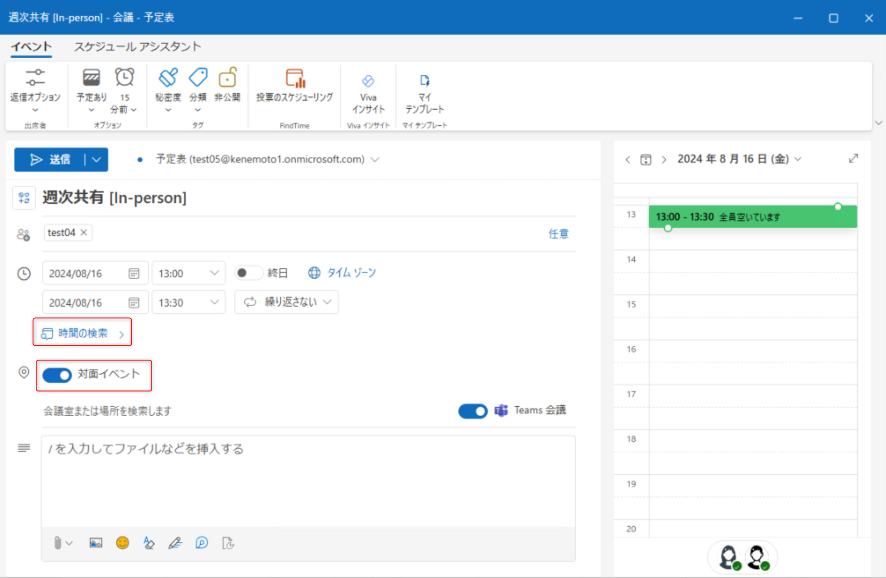
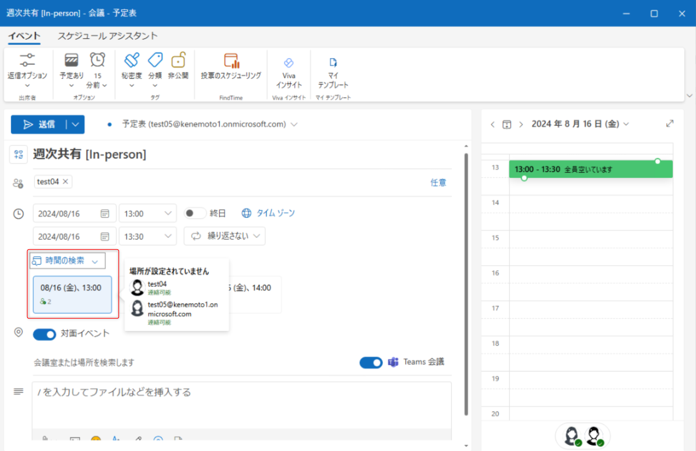

## 2. スケジュール アシスタントを使用する

スケジュール アシスタントを使用して、会議のための時間を簡単に見つけることができます。新しい Outlook for Windows では、スケジュール アシスタントで出席者のタイム ゾーンとスケジュール ラベルを確認できます。ただし、最低 1 人の出席者のタイム ゾーンが異なる場合にのみ出席者のタイム ゾーンは表示されます。  
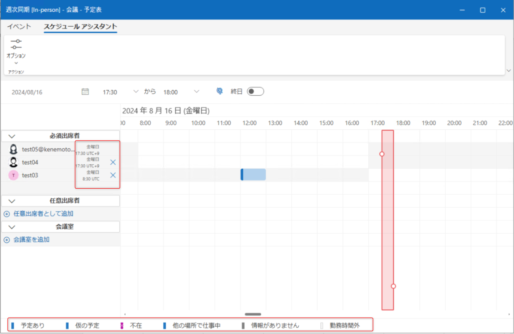

## 3. オンライン会議の自動設定

新しい Outlook for Windows では、すべての会議が既定でオンラインとなります。出席者を追加すると、[Teams 会議] トグルがオンになります。従来の Outlook for Windows と異なり、Teams 会議のリンクと詳細は会議の招待が送信されてから追加されます。開催者は招待を送信した後で、会議の招待を表示して Teams 会議の詳細を確認・コピーすることが可能となります。なお、Microsoft は本動作の更新に取り組んでおり、将来的には従来の Outlook for Windows と同じエクスぺリエンス (会議の招待を送信する前に会議リンクが作成・追加される動作) になる予定です。  
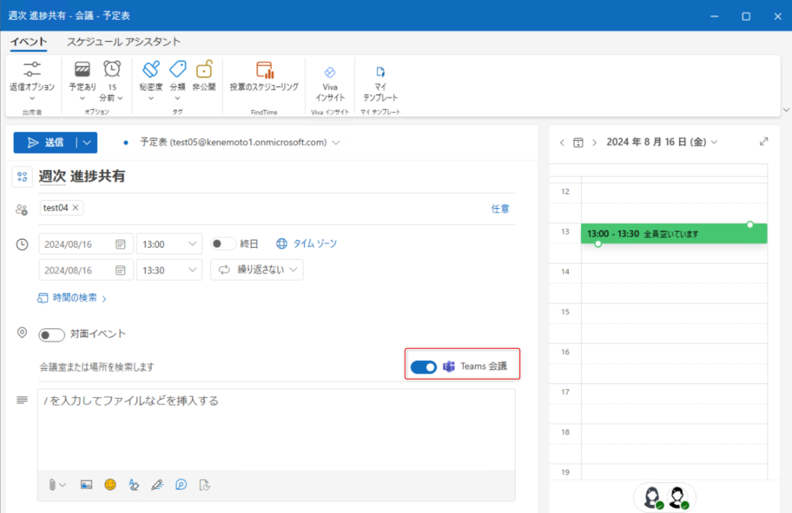

注 – [設定]-[予定表]-[イベントと出席依頼]-[すべての会議にオンライン会議を追加] にて、オンライン会議の自動設定を有効または無効にすることができます。  
Zoom や Cisco WebEx などのサード パーティのオンライン会議プロバイダーを使用している場合、それらの Web アドインがインストールされていることを前提として会議プロバイダーの選択肢として表示されます。詳細は[こちら](https://support.microsoft.com/office/make-every-meeting-online-70f9bda0-fd29-498b-9757-6709cc1c73f0)をご覧ください。  
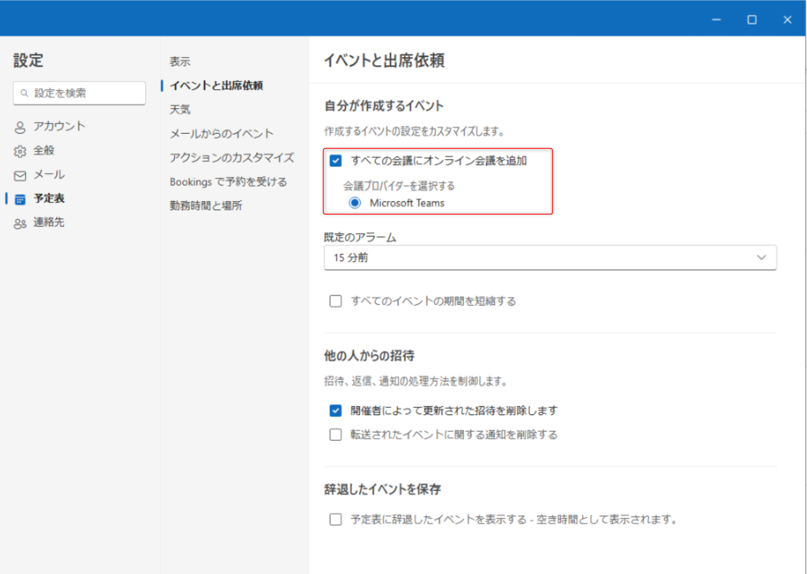

## 4. 出席者リストの非表示

会議の招待を受け取ったユーザーが出席者を確認できないように出席者リストを非表示にすることができます。新しい会議を設定する際に [返信オプション]-[出席者リストを表示しない] をクリックします。  
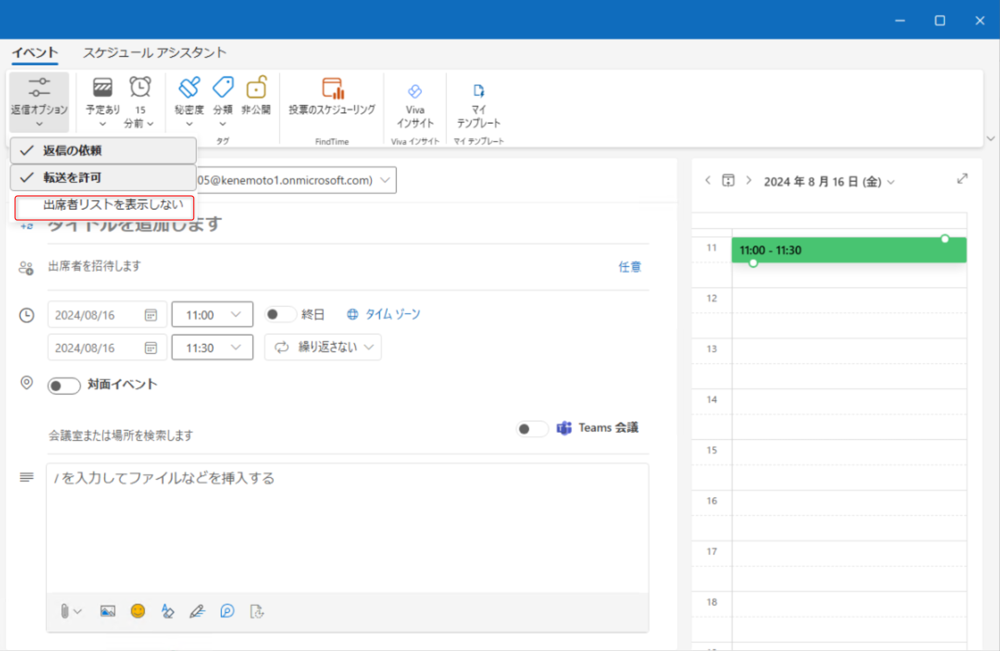

## 5. 出席者による会議室の追加

新しい Outlook for Windows では出席者が会議の招待を会議室へ転送することで、その会議室を追加できます。その後、その会議室はすべての出席者に表示されます。  
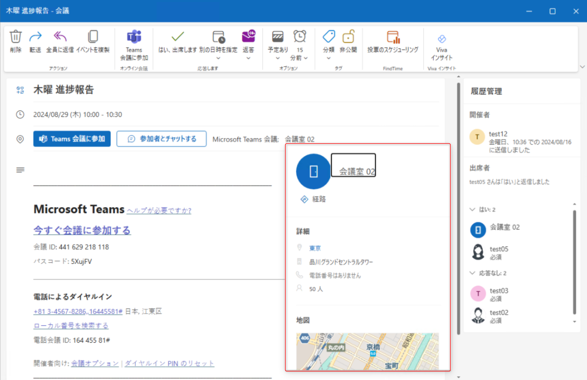

## 6. 定期的なイベントの編集

新しい Outlook for Windows では、定期的なイベントを編集する際に以下のオプションがあります。
1. このイベント – 定期的なイベントの選択された回のみを更新します。
2. 今回とこれ以降のすべてのイベント – 選択された回とそれ以降の回のみを変更し、古い回は変更されません。このオプションは従来の Outlook for Windows には存在しません。
3. この定期的なイベントのすべて – 定期的なイベントのすべての回を更新します。
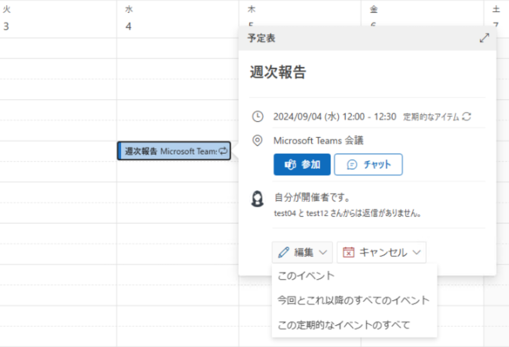

## 7. 会議を複製する

予定表上でイベントを右クリックし、[イベントを複製] を選択します。これにより、既存のイベントを活用して新たな会議の招待を送信できます。会議フォームのリボンからもこれを行うことができます。
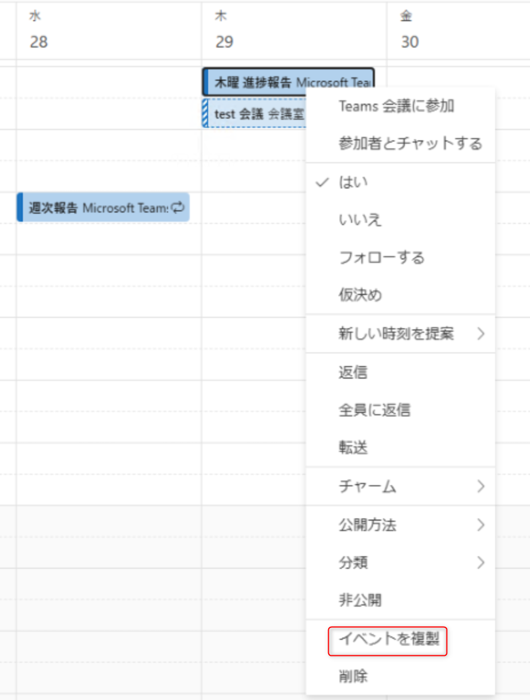
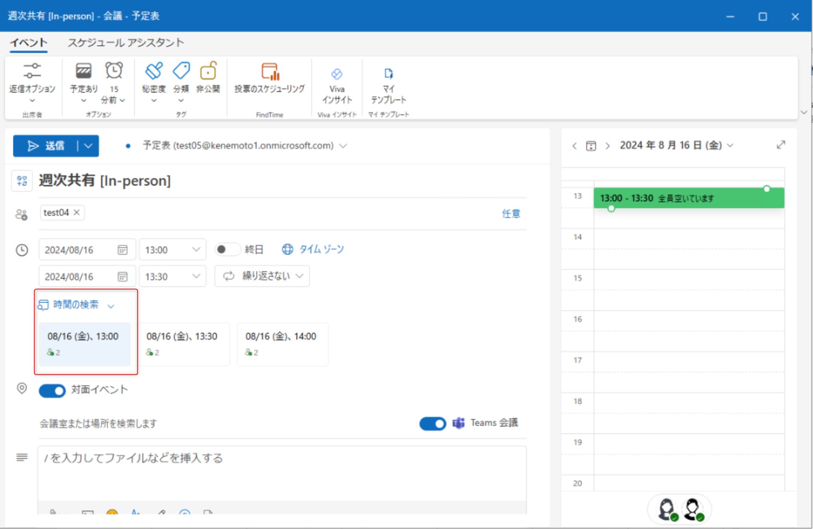

## 8. 複数のタイム ゾーンを予定表に追加する

新しい Outlook for Windows では、異なるタイム ゾーンでの会議を簡単に管理できます。従来の Outlook for Windows では 3 つのタイム ゾーンしか予定表へ追加できないのに対し、新しい Outlook では最大 20 のタイム ゾーンを追加できます。  
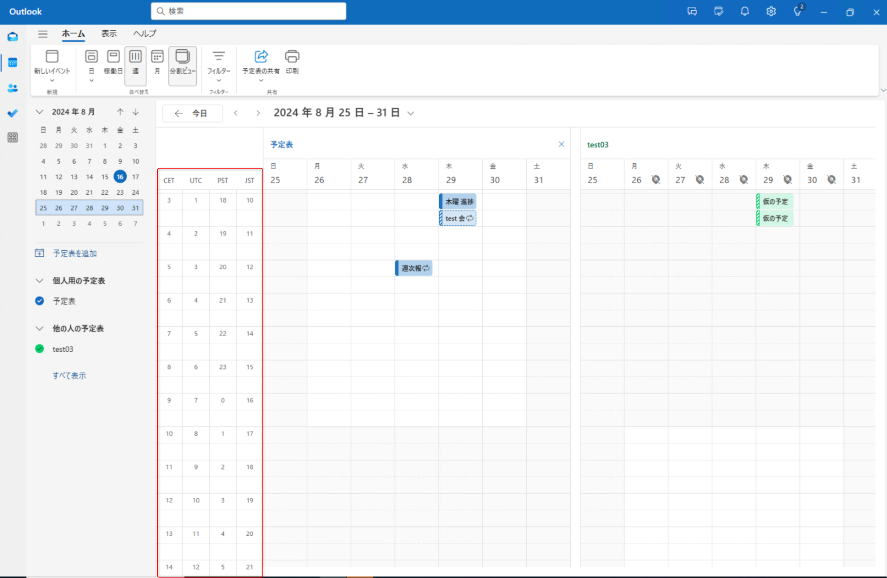
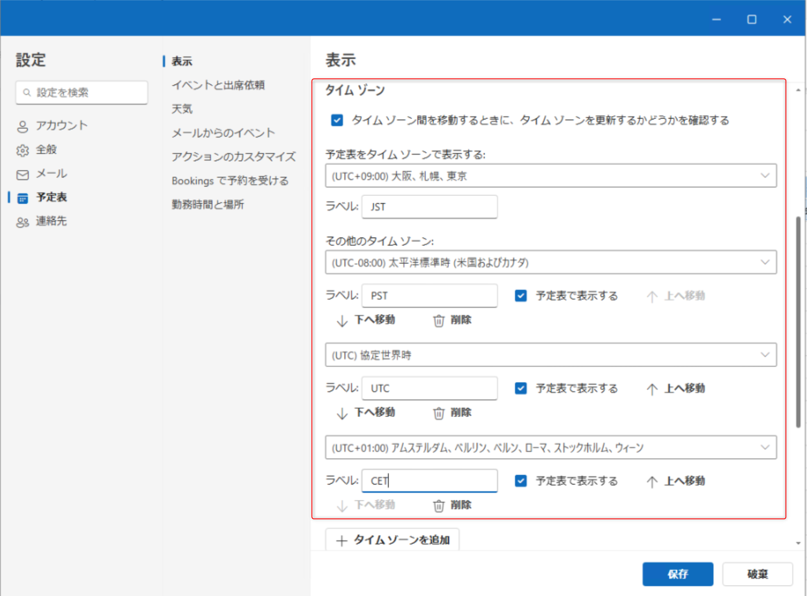

## 9. 予定表で役員の色分類項目を使用する

予定表上のイベントを右クリックし、[分類] から役員の色分類項目を選択することが出来ます。将来的には、役員秘書や代理人が役員の色分類項目を管理できるようになる予定です。
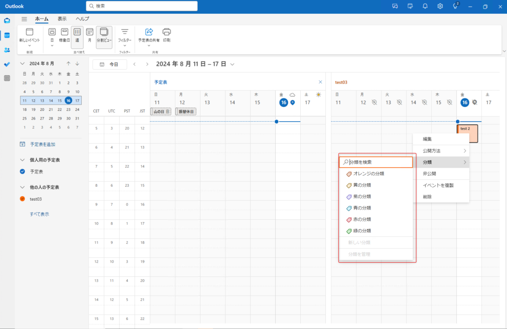

## 10. 共有予定表の通知を受け取る

新しい Outlook for Windows では、共有予定表のイベントの変更に関する通知を受け取ることができます。[設定]-[予定表]-[共有予定表]-[予定表の更新情報] から通知を受け取りたい共有予定表を選択できます。
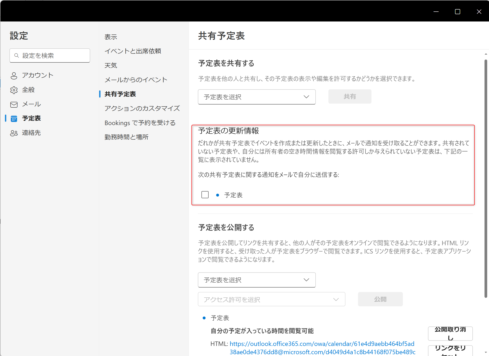

## 11. 返信が要求されている会議の招待に対して、出席者が返信せずに出欠応答しても、開催者はその応答内容を追跡できる

従来の Outlook for Windows では返信が要求されている会議の招待に対して、出席者が [返信しない] を選択して出欠応答すると、開催者はその応答内容を追跡することができません。  
しかし、新しい Outlook for Windows では出席者が [開催者にメールを送信する] をオフにして出欠応答しても、開催者はその応答内容を追跡することができます。ただし、これは出席者と開催者が同じ M365 テナント（または同じ組織）に存在する場合に限ります。  
将来的には、異なるテナント間での追跡もサポートする予定です。
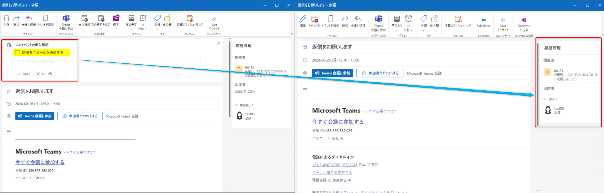

## 12. 出席を辞退した会議と返信が要求された会議の招待を保持する

必要に応じて、後で出欠応答を変更できるように出席を辞退した会議を予定表上で保持することができます。これは [設定]-[予定表]-[イベントと出席依頼]-[辞退したイベントを保存] のチェックボックスで有効化できます。  
また、返信が要求された会議の招待も受信トレイに保存して、後で簡単に見つけることができます。これは [設定]-[予定表]-[イベントと出席依頼]-[他の人からの招待]-[返信後に受信トレイから招待を削除する] で設定します。  
役員秘書や代理人が使用する予定表および受信トレイにこれらの設定が適用されるには、役員の新しい Outlook for Windows で設定する必要があります。(役員の新しい Outlook for Windows で設定を行わない限り、役員秘書や代理人が代わりに辞退した役員のイベントや会議の招待は保持されません。)
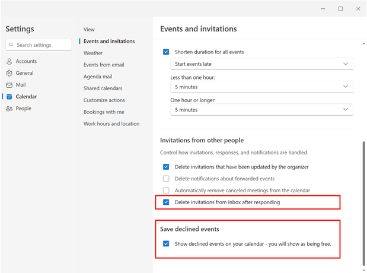

## 13. 会議の出席を辞退してフォローする

新しい RSVP オプションでは [フォローする] をクリックして、会議の招待を辞退しつつ、会議チャット、会議の録画、会議のノートにアクセスすることができます。これにより、役員や役員秘書・代理人は参加できない会議の情報を得ることができます。  
なお、この機能は現在展開中であり、一部のユーザーには表示されない場合があります。
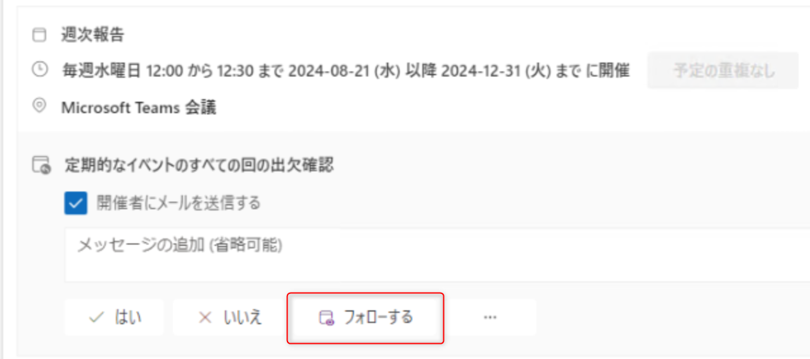

## フィードバックを共有する

新しい Outlook for Windows を試してフィードバックを共有することをお勧めします。[ヘルプ]-[フィードバック] から新しい Outlook for Windows のエクスペリエンスに関するフィードバックを送信できます。コメントを追加する際は、"I am an EA (Executive Assistant)" または "I am a delegate" と記載してください。
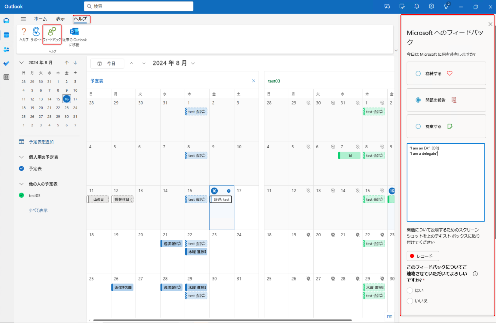

新しい Outlook for Windows の最新機能について情報を入手するには、[ロードマップ](https://www.microsoft.com/en-us/microsoft-365/roadmap?filters=Outlook%2CDesktop%2CWeb&searchterms=%23newoutlookforwindows)をフォローしてください。  
本ブログの内容は今後サポート記事としても公開される予定であり、公開されたらここにリンクされます。