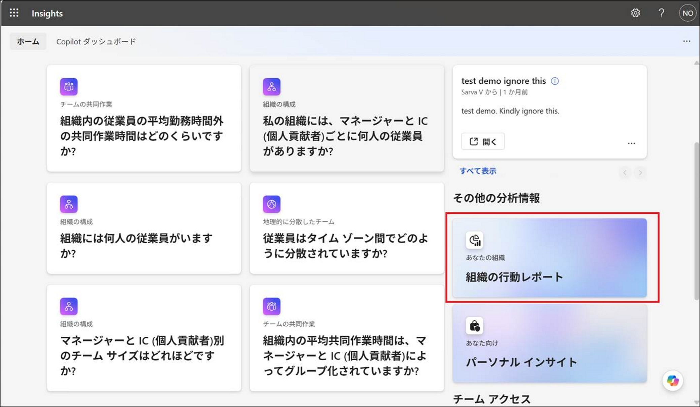

こんにちは。いつも Viva Insights を利用いただきまして、ありがとうございます。
Viva Insights のよくあるお問い合わせとして「最小チーム サイズと最小グループ サイズの違いは何ですか?」というご質問をいただくことがあります。

違いを簡潔にまとめると以下の通りです。
##### 最小チーム サイズ: マネージャー単位での分析表示条件
##### 最小グループ サイズ： プライバシー保護のための集計条件
 
本記事では  Viva Insights で設定する最小チーム サイズと最小グループ サイズの違いについて紹介します。
それぞれの設定個所と具体的な内容は以下の通りです。
 

#### 最小チーム サイズとは
[マネージャーの設定]-[最小チーム サイズ] で設定、確認ができます。

こちらの最小チーム サイズの設定によって、条件に合致したマネージャーは Viva Insights の Organization 分析情報を表示できるようになります。
ここでいうマネージャーとは Microsoft Entra ID のマネージャー属性に設定されているユーザーとなります。
例えば、ユーザー A のマネージャー属性にユーザー B が設定されている場合、ユーザー B がユーザー A の直属のマネージャー、ユーザー A がユーザー B の直属の部下ということになります。
 
この最小チーム サイズに設定する数値には、マネージャーおよびそのマネージャー直属のすべてのユーザー (部下) の数を含みます。
例えば、こちらの値を 5 に設定するとマネージャーを含めた 5 ユーザー未満のグループのマネージャーは Organization 分析情報が表示されない状態となります。
なお、この数値を 5 より小さくすることはできません。
 
こちらの数値を設定すると [資格のあるマネージャー] と [有効化済みマネージャー] に対象となるマネージャー数が表示されることとなります。
上図の例を用いると以下となります。
- 資格のあるマネージャー: マネージャーおよびそのマネージャー直属のユーザーが 5 人以上のユーザー (マネージャー) が 4 人いることとなります
- 有効化済みマネージャー: 実際に Organization 分析情報が表示可能になっているユーザー (マネージャー) が 4 人いることとなります
 
また、組織として以下のようにマネージャーが階層的に存在したとします。

マネージャー A の配下にはマネージャー B しかいない場合でもマネージャー B の配下には 4 名のユーザー C, D, E, F がいるため、マネージャー A も Viva Insights 上のマネージャーと認識され、Organization 分析情報を表示できるようになります。
Organization 分析情報が表示可能になっている場合 (最小チーム サイズの条件を満たしている場合)、個人のインサイトに [組織の行動レポート] として表示されることとなります。

なお、マネージャーがこれらの分析情報を表示するには、マネージャーに Viva insights のライセンスを割り当てる必要があります。
 

#### 最小グループ サイズとは
[プライバシー設定] の [グループの最小サイズ] で設定、確認ができます。

こちらの最小グループ サイズは、個々のプライバシーを保護するために設定する値となります。
この最小チーム サイズに設定する数値には、集計対象とする Outlook と Teams でアクティブなユーザーが含まれます。
例えば、Outlook と Teams でアクティブなユーザーが 2 ユーザーなどの少数の場合、その結果に基づいてその 2 ユーザーが誰なのかなどの個人に関する情報を推測できる場合があります。
Viva Insights ではこのような個人を特定できる状況を防ぐため、Outlook と Teams でアクティブなユーザーが最小グループ サイズよりも少ない場合、数週間 Organization 分析情報を非表示にします。
なお、この数値を 5 より小さくすることはできません。

具体的には最小グループ サイズよりも少ない場合には以下のような表示となります。

条件を満たしている場合には実際に数値が表示されます。
なお、最小チーム サイズと最小グループ サイズの設定はそれぞれ独立したものとなり、両者に相関関係はありません。
 
これらの違いについては以下の公開情報にも記載がありますので、ご参照ください。
[マネージャー設定を構成する](https://learn.microsoft.com/viva/insights/advanced/setup-maint/manager-settings)

本情報の内容（添付文書、リンク先などを含む）は、作成日時点でのものであり、予告なく変更される場合があります。

