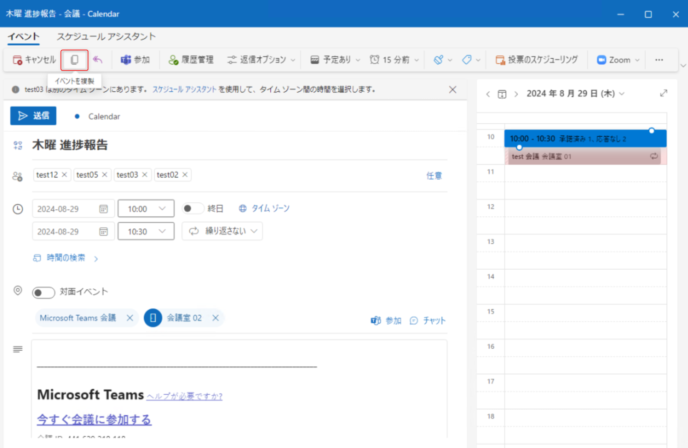
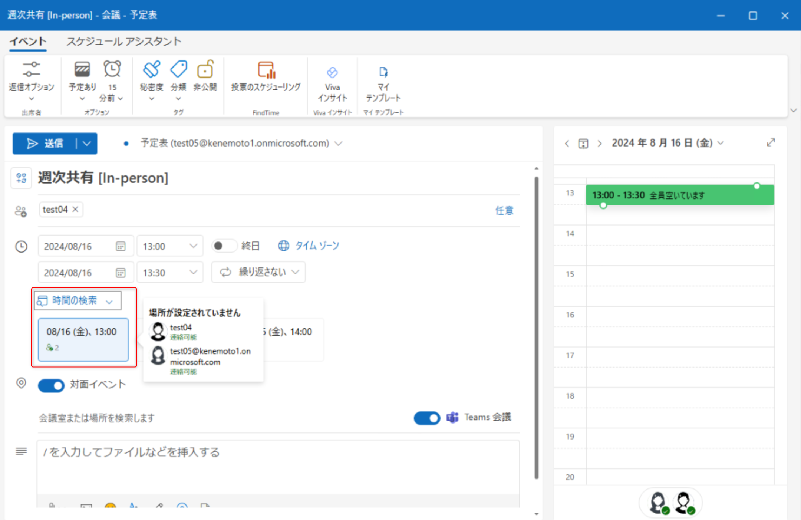

※ この記事は、[The New People Directory Search Experience in Outlook: Smarter, Faster, and More Connected Than Ever](https://techcommunity.microsoft.com/blog/outlook/the-new-people-directory-search-experience-in-outlook-smarter-faster-and-more-co/4504712) の抄訳です。最新の情報はリンク先をご確認ください。この記事は Microsoft 365 Copilot および GitHub Copilot を使用して抄訳版の作成が行われています。

Outlook 内で、最も重要な人々を見つけ、整理し、つながる方法を再設計しました。

連絡先の管理は、常に仕事の中心的な部分でした。しかし私たちの働き方は劇的に変化しました。本日は、Outlook に完全に再設計された People (ユーザー) エクスペリエンスを発表します。これにより、連絡先をこれまでより速くスマートに見つけ、整理し、つながることができます。世界中の同僚に連絡を取る場合でも、最も重要なビジネス関係を管理する場合でも、新しい Outlook の People は数分ではなく数秒でそれを実現するよう設計されています。

## 瞬時に誰でも見つかるユーザー ディレクトリ検索

皆さんのお声はしっかりと届いています。複雑な組織ツリーや深くネストされたディレクトリ階層をたどって 1 人の連絡先を見つけるには時間がかかりすぎる、というご指摘です。そこで、より優れたエクスペリエンスを実現しました。

Outlook の新しい People には、すべての連絡先を瞬時に手元に置く、強力でインテリジェントな検索エクスペリエンスが搭載されています。名前、場所、役職、部署、または自分で追加したメモを入力するだけで、People がすぐに適切な人物を表示します。組織図の階層をたどったり、アルファベット順のリストをスクロールしたりする必要はもうありません。入力して、見つけて、つながるだけです。

この機能を支える要素は次のとおりです。

- **高速なキーワード検索** - 名前、メール アドレス、役職、場所、部署、さらには自分のメモやタグを横断して検索できます。わずか数回のキー入力で十分です。
- **スマート候補** - 入力する際に、People はコミュニケーション パターンと組織のコンテキストに基づいて、最も関連性の高い候補をインテリジェントに表示します。
- **1 回の検索で、すべての連絡先ソースを網羅** - 組織のディレクトリ内の人物も個人の連絡先もリンクされたアカウントの連絡先も、検索によってすべてが 1 つの統合された結果セットにまとめられます。
- **即座にアクション** - 探していた人物を見つけたら、検索結果から直接メールを送ったり、電話をかけたり、Teams チャットを開始したりできます。余分なクリックは不要です。

これが、再設計された連絡先の発見方法です。以前は階層ツリーを何度もクリックしながら探し回る必要があったことが、今では 1 回のスムーズな操作で完結します。自分の周りにいるあらゆる人と、最速でつながるための手段です。

## モダンで統合された連絡先管理エクスペリエンス

これらの主要な革新に加えて、新しい Outlook の People は、毎日の連絡先管理方法を完全にリフレッシュします。

- **モダンなマルチ列テーブル ビュー** - クリーンでカスタマイズ可能なテーブル レイアウトですべての連絡先を一目で確認できます。これまでより速く連絡先を並べ替え、フィルター処理し、一覧を素早く見渡すことができます。
- **すぐに使えるクイック アクション** - 連絡先リストから直接、任意の連絡先にメールを送ったり、電話をかけたり、チャットしたりできます。最初に連絡先カードを開く必要はありません。
- **複数選択と一括操作** - 複数の連絡先を一度に分類、メール送信、または管理する必要がありますか？　すべてを選択して 1 ステップでアクションを実行できます。
- **柔軟な整理のためのカテゴリ** - Outlook 全体で機能する色分けされたカテゴリで連絡先を整理できます。「主要クライアント」「プロジェクト チーム」「ベンダー」など、ワークフローに合ったタグを連絡先に付けられます。
- **インポートとエクスポート** - CSV ファイルから連絡先を簡単に取り込んだり、必要なときに連絡先データをエクスポートしたりできます。
- **どこでも一貫したエクスペリエンス** - デスクトップの Outlook でも、Web の Outlook でも、Teams でも、People エクスペリエンスは同じです。モダンで、速く、信頼性が高いです。

## パフォーマンスと信頼性のために構築

新しい Outlook の People は、パフォーマンスを核心に据えて一から構築されました。Microsoft 内部の何千人ものユーザーからの広範なテストとフィードバックを経て、機能が豊富なだけでなく、大規模な連絡先リストでも高速で安定した信頼性の高いエクスペリエンスを提供します。あらゆる操作が遅延なく動作し、即座に応答するよう設計されています。

## 今すぐ始める

新しい People エクスペリエンスは、現在、新しい Outlook for Desktop で利用可能であり、すべての Microsoft 365 ユーザー向けに Web 上の Outlook にも展開中です。利用を開始するには:

1. 新しい Outlook を開き、左側のナビゲーション レールにある People アイコンをクリックします。
2. 名前、役職、場所、またはキーワードで誰かを検索し始めます。
3. 新しいテーブル ビューで連絡先を探索し、クイック アクションを試してみてください。

新しい Outlook の People が、つながり方やコラボレーションの方法にとって何を意味するか、非常に楽しみにしています。これはまだ始まりに過ぎません。まもなく共有できるイノベーションがさらに多くあります。

ぜひフィードバックをお聞かせください! Outlook 内で [ヘルプ] > [フィードバック] を選択して直接フィードバックを共有するか、Microsoft Tech Community での会話に参加してください。

Outlook の People チームは、世界最高の連絡先管理エクスペリエンスの構築に取り組んでいます。そして、私たちはまだ始まったばかりです。
